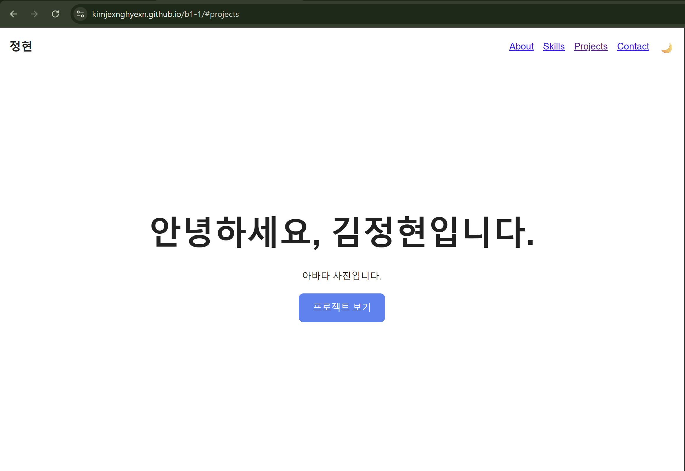
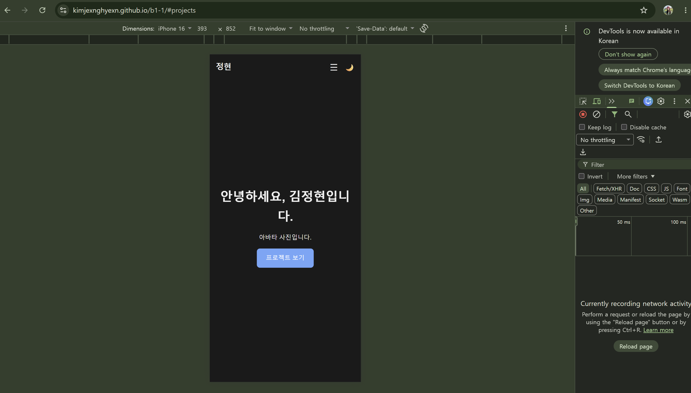
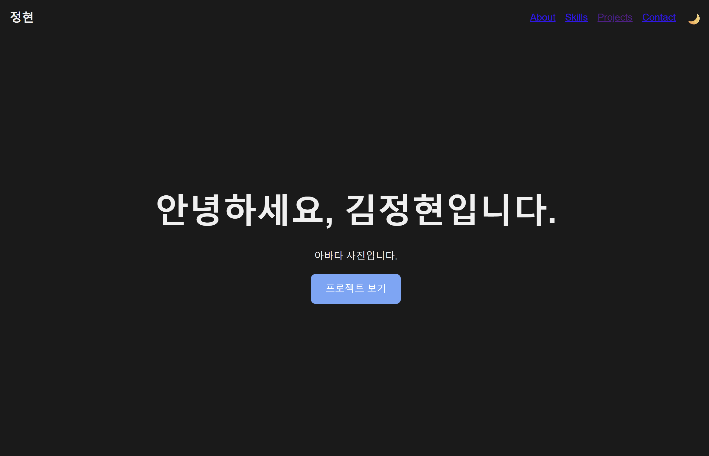

# 정현 포트폴리오

외부 라이브러리 없이 **순수 HTML, CSS, JavaScript**만으로 만든 반응형 포트폴리오 웹사이트입니다.

React를 배우기 전에 필요한 기초 개념(DOM 조작, 이벤트 처리, 비동기 통신)을 직접 구현하면서, **"사용자 이벤트 → 상태 변경 → 화면 업데이트"** 흐름을 익히는 것을 목표로 했습니다.

## 배포 URL

https://kimjexnghyexn.github.io/b1-1/

## 사용 기술

| 구분 | 내용 |
|---|---|
| HTML5 | 시맨틱 마크업 (`header`, `nav`, `main`, `section`, `article`, `footer`) |
| CSS3 | CSS 변수, Flexbox, Grid, 미디어쿼리, transition |
| JavaScript (ES6+) | 화살표 함수, 템플릿 리터럴, 구조분해 할당, 스프레드 문법, `map`/`filter`/`forEach` |
| 비동기 처리 | `fetch`, `async`/`await`, `try`/`catch` |
| Web API | Intersection Observer, localStorage |
| 외부 API | GitHub REST API |
| 개발 환경 | VS Code, Live Server, Git, GitHub Pages |

## 주요 기능

### 레이아웃
- **반응형 디자인**: 모바일 퍼스트로 작성하고, 768px(태블릿)과 1024px(데스크톱)에서 레이아웃이 바뀝니다.
- **네비게이션**: Flexbox로 로고는 왼쪽, 메뉴는 오른쪽에 배치했습니다.
- **프로젝트 카드**: Grid의 `repeat(auto-fit, minmax(250px, 1fr))`로 화면 너비에 따라 한 줄에 들어가는 카드 수가 자동으로 바뀝니다.

### 인터랙션
- **다크 모드**: 토글 버튼으로 테마를 바꾸고, 설정을 localStorage에 저장해 새로고침 후에도 유지합니다.
- **햄버거 메뉴**: 모바일에서 메뉴를 숨기고, 버튼 클릭 시 `classList.toggle('active')`로 열고 닫습니다. 메뉴 링크를 누르면 메뉴가 자동으로 닫힙니다.
- **부드러운 스크롤**: 메뉴 클릭 시 해당 섹션으로 부드럽게 이동하며, 고정된 헤더에 제목이 가려지지 않도록 여백을 두었습니다.
- **네비게이션 스타일 변경**: 일정 거리 이상 스크롤하면 헤더 배경색과 그림자가 바뀝니다.
- **스크롤 탑 버튼**: 일정 거리 이상 스크롤하면 버튼이 나타나고, 클릭하면 맨 위로 이동합니다.
- **스크롤 애니메이션**: Intersection Observer로 섹션이 화면에 들어올 때 아래에서 위로 나타납니다.

### GitHub API 연동
- `https://api.github.com/users/kimjexnghyexn/repos`에서 저장소 목록을 불러와 카드로 표시합니다.
- 포크한 저장소는 `filter`로 제외하고, 최근 업데이트 순으로 정렬합니다.
- 로딩, 성공, 빈 상태, 에러 네 가지 상태를 각각 다른 UI로 표시합니다.
- 인증 없이 호출하면 시간당 60회 제한이 있어, 한도 초과(403 응답) 시 별도의 안내 메시지와 재시도 버튼을 보여줍니다.

### 폼 유효성 검사
- 이름, 이메일, 메시지의 필수값을 검사합니다. 공백만 입력한 경우도 빈 값으로 처리합니다.
- 이메일은 정규식으로 형식을 검사합니다.
- 입력할 때마다 실시간으로 검사하고, 에러 메시지는 각 입력칸 바로 아래에 표시합니다.
- 제출 시 `event.preventDefault()`로 새로고침을 막고, 모든 값이 올바르면 성공 메시지를 표시합니다.

## 설정한 기준값

| 항목 | 값 | 코드의 상수 이름 |
|---|---|---|
| 네비게이션 배경 변경 | 스크롤 60px 이상 | `NAV_SCROLL_THRESHOLD` |
| 스크롤 탑 버튼 표시 | 스크롤 300px 이상 | `TOP_BTN_THRESHOLD` |
| Intersection Observer threshold | 0.2 (요소가 20% 보일 때) | `OBSERVER_THRESHOLD` |
| 태블릿 브레이크포인트 | 768px | - |
| 데스크톱 브레이크포인트 | 1024px | - |

## 상태 → 렌더링 흐름

### 1. 다크 모드
```
토글 버튼 클릭 (이벤트)
→ <html>의 data-theme 속성 변경 + localStorage 저장 (상태 변경)
→ [data-theme="dark"]의 CSS 변수가 적용되어 전체 색상 변경 (렌더링)
```

### 2. GitHub 프로젝트 목록
```
페이지 로드 또는 재시도 버튼 클릭 (이벤트)
→ projectState.status가 loading → success / empty / error로 변경 (상태 변경)
→ renderProjects()가 현재 상태에 맞는 화면을 그림 (렌더링)
```
상태는 반드시 `setProjectState()`를 통해서만 바꾸도록 해서, 상태가 바뀌면 화면도 항상 함께 바뀌도록 했습니다.

### 3. Contact 폼
```
입력 또는 제출 (이벤트)
→ formErrors 객체의 필드별 에러 메시지 변경 (상태 변경)
→ renderFormErrors()가 에러 문구와 빨간 테두리를 표시하거나 숨김 (렌더링)
```

## 폴더 구조

```
b1-1/
├── index.html        # 메인 페이지
├── css/
│   └── style.css     # 스타일 (CSS 변수, 레이아웃, 반응형)
├── js/
│   └── main.js       # 인터랙션, API 연동, 폼 검사
├── images/
│   └── profile.jpg   # 프로필 이미지
├── screenshots/      # README용 스크린샷
└── README.md
```

## 로컬에서 실행하기

1. 저장소를 클론합니다.
   ```bash
   git clone https://github.com/kimjexnghyexn/b1-1.git
   ```
2. VS Code로 폴더를 열고, `index.html`에서 우클릭 후 **Open with Live Server**를 선택합니다.

`index.html` 파일을 직접 더블클릭해서 열면 일부 기능(API 호출 등)이 제대로 동작하지 않을 수 있어 Live Server 사용을 권장합니다.

## 스크린샷

### 데스크톱


### 모바일


### 다크 모드
